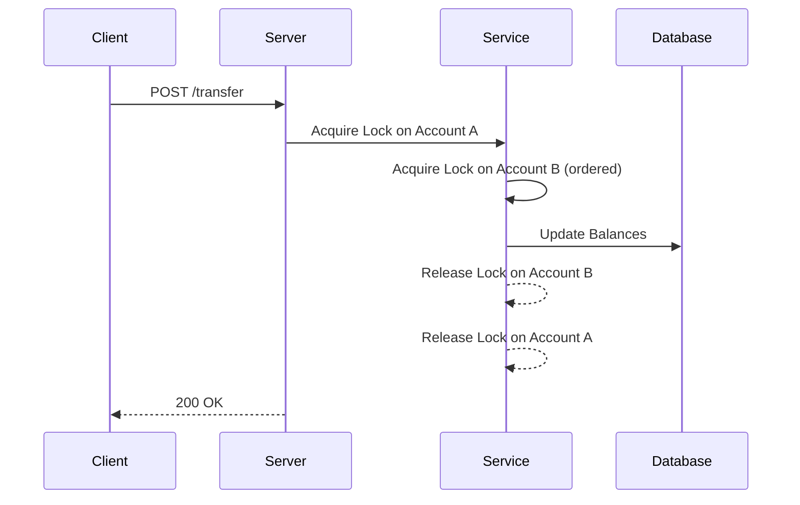

# Core Banking Lab

[](https://golang.org/dl/) [](https://github.com/fandangolas/core-banking-lab/blob/main/LICENSE)

## Table of Contents

- [Overview](#overview)
- [Motivation](#motivation)
- [Current Status](#current-status)
- [Roadmap & Next Steps](#roadmap--next-steps)
- [Requirements](#requirements)
- [Getting Started](#getting-started)
- [Examples](#examples)
- [Contributing](#contributing)
- [License](#license)

## Overview

Core Banking Lab is an engineering sandbox inspired by real-world core banking systems. It explores safe concurrent operations, observability, authentication, CI/CD, and Kubernetes orchestration—simulating high-reliability financial infrastructure.

## Motivation

Traditional banking APIs often hide the complexity of concurrency control, infrastructure orchestration, and observability. With Core Banking Lab, you get hands-on experience in:

- **Concurrency**: safe, high-throughput operations across multiple accounts.  
- **Observability**: real-time metrics, logs, and dashboards.  
- **Infrastructure**: containerization, Kubernetes, and CI/CD pipelines.

## Current Status

| Phase                                     | Status       |
|-------------------------------------------|--------------|
| 1. Architecture & Project Structure       | ✅ Completed  |
| 2. Advanced Concurrency                   | ✅ Completed  |
| 3. Testing                                | 🔄 In Progress |
| 4. Real-Time Simulation                   | 🔲 Planned    |
| 5. Observability                          | 🔲 Planned    |
| 6. Infrastructure & Deployment            | 🔲 Planned    |
| 7. CI/CD Automation                       | 🔲 Planned    |
| 8. Optional Features (JWT, scheduler, CLI)| 🔲 Planned    |
| 9. Portfolio Presentation (README, GIFs)  | 🔲 Planned    |

## Roadmap & Next Steps

> At this early stage, we have the basic package structure in place and a handful of initial tests. The next focus is to review and expand these foundations:

1. **Core Architecture Review**  
   - Audit and refine package boundaries (`handler`, `service`, `repository`, `domain`)  
   - Validate and refactor existing unit tests for coverage and clarity  
2. **PostgreSQL Integration**  
   - Implement the `repository/postgres` adapter with basic CRUD operations  
   - Add containerized integration tests (Docker / Testcontainers)  
3. **Comprehensive Testing & Benchmarks**  
   - Expand unit and integration test coverage, including edge cases and concurrency scenarios  
   - Introduce simple load benchmarks to measure throughput and latency under stress  
4. **API Specification**  
   - Draft an OpenAPI/Swagger definition for all core endpoints  
   - Generate and validate client stubs against the spec  
5. **Observability Foundations**  
   - Instrument key paths with Prometheus metrics (transactions/sec, error rates)  
   - Prototype Grafana dashboards to visualize system health  
6. **CI/CD Pipeline Setup**  
   - Create a GitHub Actions workflow for build, lint, test and container builds  
   - Automate deployment artifacts to a container registry  
7. **Documentation & Differentiation**  
   - Produce concurrency flow diagrams and benchmark reports  
   - Capture lessons learned, architectural trade-offs and next experiment ideas

## Requirements

- Go 1.20 or later  
- Docker (for integration tests)  
- Testcontainers (Go library for containerized tests)  
- Git

## Getting Started

```bash
git clone https://github.com/fandangolas/core-banking-lab.git
cd core-banking-lab
go run src/main.go
```
The server will start on `localhost:8080` by default.

## Examples

### Sequence Diagram


### Sample cURL Request
```bash
curl -X POST http://localhost:8080/transfer \
  -H "Content-Type: application/json" \
  -d '{"fromAccount":"A","toAccount":"B","amount":100}'
```

## Contributing

Contributions are welcome! Please read [CONTRIBUTING.md](CONTRIBUTING.md) for guidelines on code style, testing, and the pull request process. Open issues and pull requests are encouraged.

## License

This project is licensed under the MIT License. See [LICENSE](LICENSE) for details.

