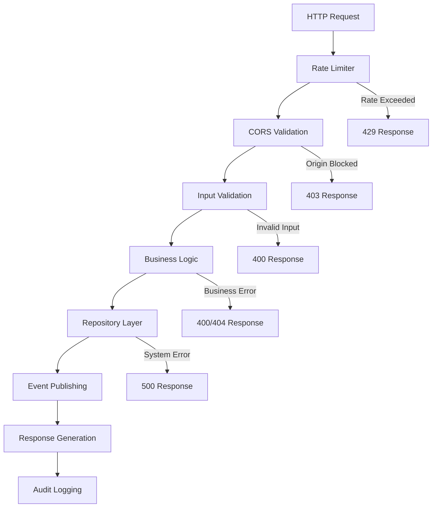

# Architecture Overview

## Core Principles

This banking system is built on **production-grade architectural patterns** that prioritize:

- **Reliability**: Thread-safe operations and graceful error handling
- **Maintainability**: Clean separation of concerns and testable components  
- **Security**: Defense-in-depth with input validation and audit logging
- **Observability**: Comprehensive logging and metrics collection
- **Scalability**: Container-ready design for distributed deployment

## Diplomat Architecture Pattern

We implement a **Diplomat Architecture**—our enhanced variant of the Ports and Adapters pattern optimized for concurrent systems.

### **Layer Responsibilities**

```
┌─────────────────────────────────────────────────────────┐
│                    HTTP Layer                           │
│  • Request routing (Gin framework)                     │
│  • Rate limiting and CORS protection                   │ 
│  • Input validation and serialization                  │
│  • Request/response logging and tracing                │
└─────────────────┬───────────────────────────────────────┘
                  │
┌─────────────────▼───────────────────────────────────────┐
│                  Domain Layer                           │
│  • Core business logic and rules                       │
│  • Thread-safe account operations                      │
│  • Transaction validation and processing               │
│  • Deadlock prevention algorithms                      │
└─────────────────┬───────────────────────────────────────┘
                  │
┌─────────────────▼───────────────────────────────────────┐
│                Infrastructure Layer                     │
│  • Data persistence (Repository pattern)               │
│  • Event publishing and metrics collection             │
│  • External service integrations                       │  
│  • Configuration and environment management            │
└─────────────────────────────────────────────────────────┘
```

### **Key Architectural Benefits**

1. **Technology Independence**: Domain logic is isolated from external dependencies
2. **Testability**: Each layer can be mocked and tested independently
3. **Concurrent Safety**: Clear boundaries prevent race conditions between layers
4. **Extensibility**: New adapters can be added without changing core logic

## Component Design

### **HTTP Layer (`handlers/`)**

**Responsibilities:**
- Request routing and parameter extraction
- Input validation and sanitization  
- Rate limiting and security enforcement
- Response formatting and error handling
- Request tracing and performance metrics

**Key Implementation Details:**
```go
// Example: Structured error handling with audit logging
func Transfer(c *gin.Context) {
    // Input validation with security logging
    if err := validation.ValidateTransferRequest(req); err != nil {
        logging.Warn("Invalid transfer request", map[string]interface{}{
            "error": err.Error(),
            "ip": c.ClientIP(),
            "account_from": req.FromID,
        })
        c.JSON(http.StatusBadRequest, errors.NewValidationError(err.Error()))
        return
    }
    // ... domain logic call
}
```

### **Domain Layer (`domain/`)**

**Responsibilities:**
- Core banking business rules
- Thread-safe account operations
- Atomic transaction processing
- Concurrency control and deadlock prevention

**Key Implementation Details:**
```go
// Thread-safe account operations with ordered locking
func withAccountLock(acc *models.Account, fn func()) {
    acc.Mu.Lock()
    defer acc.Mu.Unlock()
    fn()
}

// Deadlock prevention in transfers
func ProcessTransfer(from, to *Account, amount int) error {
    // Always lock accounts in consistent order to prevent deadlocks
    if from.Id < to.Id {
        from.Mu.Lock()
        to.Mu.Lock()
    } else {
        to.Mu.Lock() 
        from.Mu.Lock()
    }
    defer from.Mu.Unlock()
    defer to.Mu.Unlock()
    
    // Atomic balance updates
    from.Balance -= amount
    to.Balance += amount
}
```

### **Infrastructure Layer (`diplomat/`)**

**Responsibilities:**
- Data persistence with Repository pattern
- Event streaming for real-time updates
- Metrics collection and health monitoring
- Configuration management

**Repository Pattern Implementation:**
```go
type Repository interface {
    CreateAccount(owner string) int
    GetAccount(id int) (*models.Account, bool)
    UpdateAccount(acc *models.Account)
    Reset() // For testing
}

// In-memory implementation for development
type InMemory struct {
    accounts map[int]*models.Account
    nextID   int
    mu       sync.RWMutex
}

// Future PostgreSQL implementation
type PostgreSQL struct {
    db *sql.DB
    // Connection pooling, transaction management
}
```

## Concurrency Design

### **Thread Safety Strategy**

The system implements **multiple layers of concurrency control**:

1. **Account-Level Locking**: Each account has its own mutex
2. **Ordered Locking**: Consistent ordering prevents deadlocks  
3. **Repository Isolation**: Database operations are thread-safe
4. **Request Isolation**: Each HTTP request operates independently

### **Deadlock Prevention Algorithm**

```go
// Always acquire locks in consistent order based on account ID
func acquireAccountLocks(from, to *Account) {
    if from.Id < to.Id {
        from.Mu.Lock()
        to.Mu.Lock()
    } else {
        to.Mu.Lock()
        from.Mu.Lock()
    }
}

// This ordering guarantees deadlock-free operations even with 
// thousands of concurrent transfers between the same accounts
```

### **Performance Characteristics**

- **Lock Granularity**: Per-account locking minimizes contention
- **Lock Duration**: Minimal—only during balance updates
- **Contention Handling**: Ordered locking eliminates circular wait conditions
- **Scalability**: O(1) lock acquisition regardless of account count

## Security Architecture

### **Defense in Depth Strategy**

1. **Perimeter Defense**: Rate limiting and CORS protection
2. **Input Validation**: Comprehensive data sanitization  
3. **Business Logic Security**: Amount limits and account validation
4. **Audit Logging**: Complete transaction trails for forensics
5. **Error Handling**: No sensitive information leakage

### **Rate Limiting Implementation**

```go
type RateLimiter struct {
    requests map[string][]time.Time
    mutex    sync.RWMutex
    limit    int           // Requests per window
    window   time.Duration // Time window
}

// IP-based rate limiting with automatic cleanup
func (rl *RateLimiter) Allow(clientIP string) bool {
    rl.mutex.Lock()
    defer rl.mutex.Unlock()
    
    now := time.Now()
    
    // Clean expired requests
    validRequests := []time.Time{}
    for _, reqTime := range rl.requests[clientIP] {
        if now.Sub(reqTime) < rl.window {
            validRequests = append(validRequests, reqTime)
        }
    }
    
    // Check limit
    if len(validRequests) >= rl.limit {
        return false
    }
    
    // Allow request
    rl.requests[clientIP] = append(validRequests, now)
    return true
}
```

## Data Flow Architecture

### **Request Processing Pipeline**



### **Event-Driven Updates**

Real-time dashboard updates use an event-driven architecture:

```go
type EventBroker struct {
    subscribers []chan models.TransactionEvent
    mutex       sync.RWMutex
}

// Publish events to all connected dashboard clients
func (eb *EventBroker) Publish(event models.TransactionEvent) {
    eb.mutex.RLock()
    defer eb.mutex.RUnlock()
    
    for _, subscriber := range eb.subscribers {
        select {
        case subscriber <- event:
            // Event delivered
        default:
            // Non-blocking: skip slow subscribers
        }
    }
}
```

## Technology Choices & Rationale

### **Framework Selection**

- **Gin Framework**: High-performance HTTP router with middleware support
- **Native Go Concurrency**: Goroutines and channels for optimal performance
- **Standard Library**: Minimal external dependencies for reliability

### **Database Strategy Evolution**

1. **Phase 1 - In-Memory**: Fast iteration and testing
2. **Phase 2 - PostgreSQL**: Production durability and ACID transactions  
3. **Phase 3 - Distributed**: Sharding and replication for scale

### **Container & Orchestration**

- **Docker**: Multi-stage builds for optimized production images
- **Kubernetes**: Service discovery, load balancing, and resilience
- **Observability Stack**: Prometheus metrics, Grafana dashboards

## Future Architecture Evolution

### **Planned Enhancements**

1. **Microservice Decomposition**: Split into account and transaction services
2. **Event Sourcing**: Complete audit trail with event replay capabilities
3. **CQRS Implementation**: Separate read and write models for optimization
4. **Distributed Caching**: Redis for high-frequency balance queries
5. **Message Queues**: Asynchronous processing for heavy operations

### **Scalability Considerations**

- **Horizontal Scaling**: Stateless API servers behind load balancer
- **Database Sharding**: Account-based partitioning for massive scale
- **CDN Integration**: Static asset delivery for dashboard
- **Circuit Breakers**: Failure isolation and graceful degradation

This architecture provides a solid foundation for a production banking system while maintaining the flexibility to evolve with changing requirements and scale.

